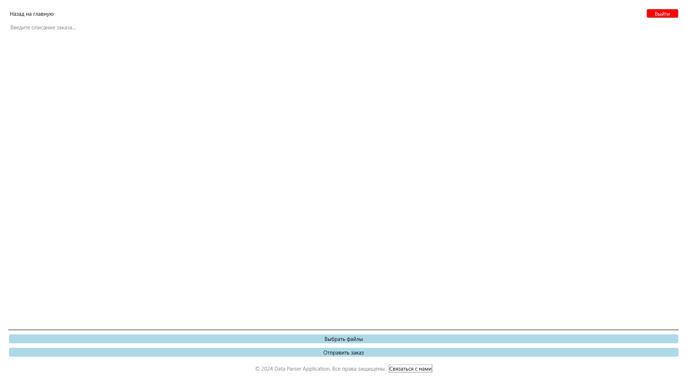

# Data Parser Application

**Data Parser Application** is a powerful tool for automating the analysis, processing, and visualization of data. This application simplifies workflows and is ideal for both small businesses and large organizations.

## Features

- User authentication (login/logout functionality).
- File uploads with descriptions (e.g., CSV, JSON).
- Interactive pricing plans with card-based UI.
- Modern design with light and dark themes.
- Responsive layout with adaptive elements.
- Navigation across multiple pages:
  - **Home Page**: Overview of the app and features.
  - **Profile Page**: Order submission with file uploads and pricing plans.
  - **Login and Registration Pages**: User authentication.
  - **About Page**: Information about the app.
- Server integration for user authentication and file uploads.

---

## Screenshots




---

## Installation

### Prerequisites

- **Qt Framework** (6.5+)
- **C++17** compatible compiler
- **CMake**
- **MinGW (Windows)** or other supported build systems
- Qt modules required:
  - `QtCore`
  - `QtWidgets`
  - `QtNetwork`
  - `QtHttpServer`

### Building the Project

1. Clone the repository:
   ```bash
   git clone https://github.com/your-username/data-parser-application.git
   cd data-parser-application
   ```

2. Install dependencies:
   - For **Windows (MSYS2)**:
     ```bash
     pacman -S mingw-w64-x86_64-qt6
     ```
   - For **Linux**:
     ```bash
     sudo apt install qt6-base-dev qt6-network-dev
     ```

3. Open the project in **Qt Creator** or use CMake:
   ```bash
   mkdir build
   cd build
   cmake ..
   cmake --build .
   ```

4. Run the application:
   ```bash
   ./DataParserApp
   ```

---

## Project Structure

```plaintext
├── client/                # Client-side application
│   ├── DataParserApp/     # Core client-side logic
│   │   ├── main.cpp       # Application entry point
│   │   ├── homepage.h/.cpp  # Home page UI logic
│   │   ├── profile.h/.cpp  # Profile page with pricing and uploads
│   │   ├── login.h/.cpp    # Login page logic
│   │   ├── register.h/.cpp # Registration page logic
│   │   ├── aboutpage.h/.cpp # About page UI
│   │   ├── authmanager.h/.cpp # Authentication manager (Singleton)
│   │   ├── resources.qrc  # Resource file for images
│   │   └── CMakeLists.txt # Build configuration
├── server/                # Server-side application
│   ├── server.cpp         # HTTP server logic
│   ├── routes.cpp         # REST API routes (login, upload)
│   └── CMakeLists.txt     # Build configuration for the server
├── screenshots/           # Screenshots for the README
├── README.md              # Project documentation
└── CMakeLists.txt         # Root build configuration
```

---

## Usage

1. **Run the Server**:
   - Navigate to the `server/` directory.
   - Build and run the server:
     ```bash
     cmake .
     cmake --build .
     ./ServerApp
     ```
   - The server listens on `http://localhost:8080`.

2. **Run the Client**:
   - Open the application built from the `client/` directory.
   - Use the login page to authenticate.
   - Upload files, explore pricing plans, and navigate the app.

---

## API Endpoints

- **POST /login**:
  - Description: Authenticates the user and returns a token.
  - Request Body:
    ```json
    {
      "username": "your_username",
      "password": "your_password"
    }
    ```
  - Response Body:
    ```json
    {
      "token": "your_token",
      "role": "user"
    }
    ```

- **POST /upload**:
  - Description: Accepts file uploads with descriptions.
  - Request Body:
    Form-data:
    - `description`: A short description of the file(s).
    - `files`: The uploaded file(s).

---

## Customization

- To modify the UI, edit the `.h/.cpp` files in the `DataParserApp/` folder.
- To add more API endpoints, update the `routes.cpp` file in the `server/` directory.

---

## Contributing

Contributions are welcome! Please submit a pull request or open an issue for any feature requests or bug fixes.

---

## License

This project is licensed under the MIT License. See the `LICENSE` file for details.

---

## Contact

For inquiries or support, please contact [your-email@example.com](mailto:your-email@example.com).
```

### Notes:
- Replace placeholder paths like `./screenshots/homepage.png` with actual paths to your screenshots.
- Add your name, contact info, or GitHub link where appropriate.
- Ensure the `LICENSE` file exists if you're using MIT or any other license.