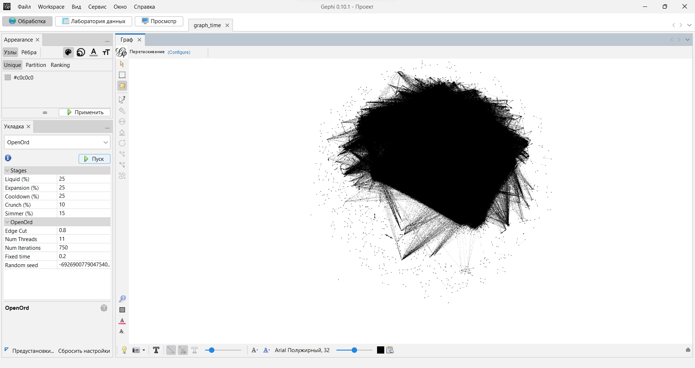
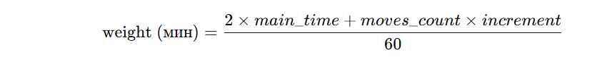
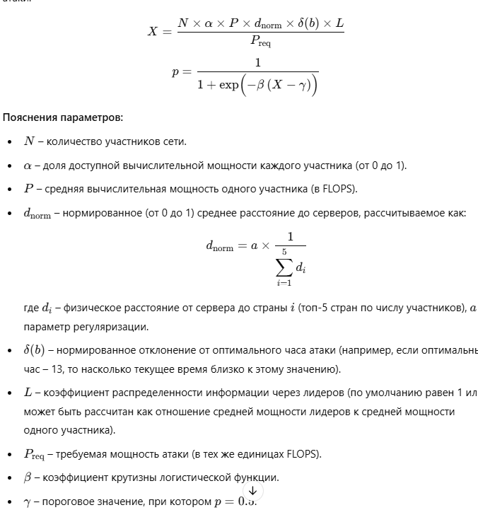

# Анализ распределённой сети с использованием ML

Проект по анализу и предсказанию поведения узлов в распределённой сети с применением машинного обучения.

## Основные возможности

- Предсказание вычислительной мощности узлов (FLOPS)
- Оценка вероятности успешного выполнения задач
- Выявление аномальных узлов
- Кластеризация устройств по поведенческим паттернам
- Деанонимизация активности узлов

## Структура проекта

```
├── data/               # Данные проекта
├── notebooks/          # Jupyter notebooks
├── src/               # Исходный код
│   ├── data/         # Скрипты для работы с данными
│   ├── models/       # ML модели
│   ├── features/     # Извлечение признаков
│   └── utils/        # Вспомогательные функции
├── tests/            # Тесты
└── configs/          # Конфигурационные файлы
```

## Установка

1. Клонируйте репозиторий
2. Создайте виртуальное окружение:
   ```bash
   python -m venv venv
   source venv/bin/activate  # для Linux/Mac
   venv\Scripts\activate     # для Windows
   ```
3. Установите зависимости:
   ```bash
   pip install -r requirements.txt
   ```

## Использование

1. Настройте конфигурацию в файле `.env`
2. Запустите Jupyter Notebook:
   ```bash
   jupyter notebook
   ```
3. Откройте notebooks/01_data_preprocessing.ipynb для начала работы

## Лицензия

MIT 


https://www.tadviser.ru/index.php/%D0%9F%D1%80%D0%BE%D0%B4%D1%83%D0%BA%D1%82:%D0%A6%D0%9E%D0%94%D1%8B_%D0%A1%D0%B1%D0%B5%D1%80%D0%B1%D0%B0%D0%BD%D0%BA%D0%B0
У нас в наших четырех дата-центрах размещено более 63 тысяч серверов различного назначения. Мы сегодня самый большой потребитель микроэлектроники и специалистов, связанных с этим, — отмечает Греф.


Как отмечается, ЦОД, расположенный в Инновационном центре «Сколково» – один из крупнейших и мощнейших дата-центров в Европе. Его площадь составляет 39 000 м2, активная мощность – до 32 МВт, количество серверных стоек – до 2000 и общий уровень отказоустойчивости (по Uptime Institute) – Tier III.

​Для оценки вычислительной мощности дата-центра (ЦОД) Сбербанка в «Сколково» можно использовать следующие данные:​

Количество серверных стоек: до 2000.​

Нагрузка на каждую стойку: 8 кВт.​
Будущее Банкинга

Расчет общей мощности:

Общая потребляемая мощность:

Общая мощность (кВт) = Количество стоек × Мощность на стойку = 2000 × 8 кВт = 16 000 кВт = 16 МВт.​

Оценка вычислительной мощности (FLOPS):

Для приблизительной оценки можно использовать коэффициент, связывающий потребляемую мощность с вычислительной производительностью.​

Ориентировочно, 1 кВт потребляемой мощности соответствует примерно 1,5–2 GFLOPS (гигафлопс) вычислительной производительности.​

Таким образом, общая вычислительная мощность = 16 000 кВт × 1,75 GFLOPS/кВт = 28 000 GFLOPS = 28 ТФлопс.


https://github.com/lichess-org/lila?tab=readme-ov-file

https://osintframework.com/

Пример данных:

Device memory: 8.0 GB

Hardware concurrency: 8.0

Screen resolution: [900, 1600]

FLOPS: 2.0e+10

Performance coefficient: 5.76

Данные сохранены в CSV файл filtered_device_performance.csv.

Статистика активности в шахматах:

Частота игр и количество ходов: Включает данные по количеству игр, средней и стандартной величине ходов в зависимости от времени суток, а также информацию о популярных дебютах.

Пример:

hour: 0

num_games: 8230

avg_moves: 65.62

std_moves: 30.09

top_eco: A00

top_eco_games: 581

Эти данные находятся в summary_hourly_chess_activity.csv.

Эти данные можно использовать для построения модели оценки вероятности взлома, где влияние клубов (и их активности), производительности устройств и временной статистики можно учитывать в виде различных факторов риска.


мне нужно чтобы вес графа высчитывался с ледующим образом:

модуль(white_elo - black_elo) / 100 + moves_count * (дополнительное время от time_control)/time_control (основное время. ПРимер расчета, если
|game_id|      white|         black|white_elo|black_elo|result|          timestamp|time_control|eco|             opening|moves_count|
+-------+-----------+--------------+---------+---------+------+-------------------+------------+---+--------------------+-----------+
|       |  uloseit99|      Xtravia9|     1625|     1826|   0-1|2015-08-13 02:58:20|       180+3|D01|Richter-Veresov A...|         50|

то вес = |1625 - 1826|/100 + 50 * 3/180 и напрвлен от Xtravia9  к uloseit99
но пример time_control: 180+3 600+0 120+0

также граф должен быть направленным (направление задает "result"). Например 1-0 задает направление от белых к черным


Вес определяет меру «значимости» или «сложности» партии

Сколько времени каждый потратил на друг друга




Использованные элементы:
fingerprints dataset
lichess api (teams)
lichess open dataset
graphana
networkx
dcoker image of jpyter server with pyspark

Забавные факты: 
   с каждым годом игроки тупеют на 1-2% процета, вот мне уже скоро 20... (в 2017
      году стредний рейтинг 1632.5, сейчас около 1540)

